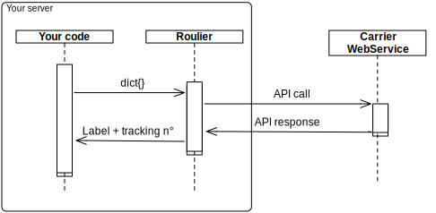

Roulier
===

Roulier is a shipping library written in Python for sending parcels.
Roulier will get a label + tracking number to your carrier for you.





* Roulier runs on your server and call each carrier API directly.
* You have to use your own credentials provided by each carriers.
* Roulier is Open Source software, AGPL-3
* Roulier integrate a multitude of carriers
    * French La Poste
    * French DPD
    * French GLS
    * French Chronopost
    * more to come... (geodis, kuehne...)

### Installation

This is not compatible with python 2.7.
Please use version < 1.0.0 (python2 branch) in that case.

### Usage

```python
from roulier import roulier

payload= {
	"auth": {
		"login": "12345",
		"password": "password",
	},
	"service": {
		"productCode": "COL"
	},
	"parcels": [{
		"weight": 3.4,
	}],
	"to_address": {
		"firstName": "Hparfr"
		"street1": "35 b Rue Montgolfier"
		"city": "Villeurbanne"
        "country": "FR",
        "zip": "69100"
   	},
   	"from_address": {
		"fristName": "Akretion France"
		"street1": "35 b Rue Montgolfier"
		"city": "Villeurbanne"
        "country": "FR",
        "zip": "69100"
   	},
}
# first parameter is the carrier type.
# second is the action and then the parameters needed by the action
response = roulier.get('laposte_fr', 'get_label', payload)


print(response)

```


Get supported carriers and related actions:
```python
from roulier import roulier
print(roulier.get_carriers_action_available())
```

### Known Issues
#### French GLS carrier :
* The glsbox webservice only manage Basic products : BP, EBP, GBP
* In the rest webservice, the incoterms don't work


### Contributors


* [@hparfr](https://github.com/hparfr) ([Akretion.com](https://akretion.com))
* [@damdam-s](https://github.com/damdam-s) ([Camp2Camp.com](http://camptocamp.com))
* [@bealdav](https://github.com/bealdav) ([Akretion.com](https://akretion.com))
* [@DylannCordel](https://github.com/DylannCordel) ([Webu.coop](https://www.webu.coop))
* [@florian-dacosta](https://github.com/florian-dacosta) ([Webu.coop](https://akretion.com))


### Dependencies

* [Cerberus](http://docs.python-cerberus.org/) - input validation and normalization
* [lxml](http://lxml.de/) - XML parsing
* [Jinja2](http://jinja.pocoo.org/) - templating
* [Requests](http://docs.python-requests.org/) - HTTP requests
* [zplgrf](https://github.com/kylemacfarlane/zplgrf) - PNG to ZPL conversion
* [unidecode](https://pypi.python.org/pypi/Unidecode) - Remove accents from ZPL
